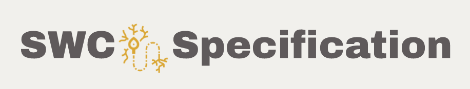

SWC specification documentation
===============================
The SWC file format is a human- and machine-readable format for representing digital reconstructions. 

Contents
^^^^^^^^
.. toctree::
    index
    swc
    governance

Latest specification
^^^^^^^^^^^^^^^^^^^^^^^^^^^^
:doc:`swc`.

Governance 
^^^^^^^^^^
Development of the SWC file format is directed by an elected :doc:`governing board </governance>`. 

Updates 
^^^^^^^
List server?	
Group applications (Facebook groups, google groups, etc)?

Contact 
^^^^^^^
For information about neuromorphological file format’s development and governance, contact nmadmin@gmu.edu

How to cite the SWC format
^^^^^^^^^^^^^^^^^^^^^^^^^^
Add reference here